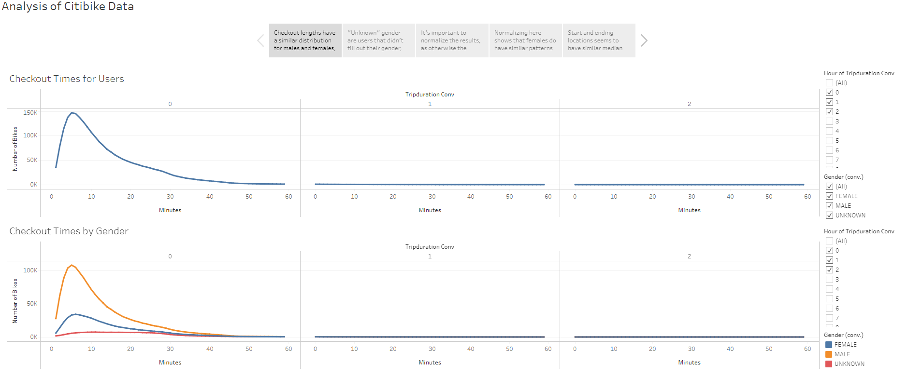
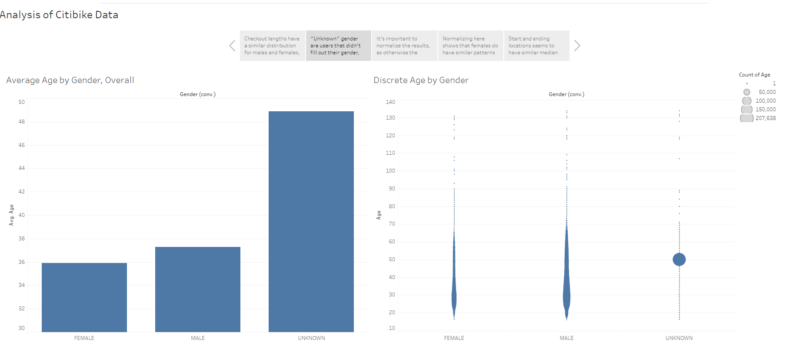
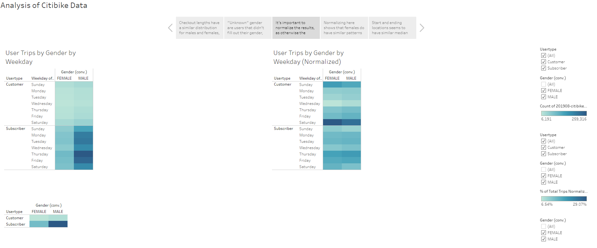
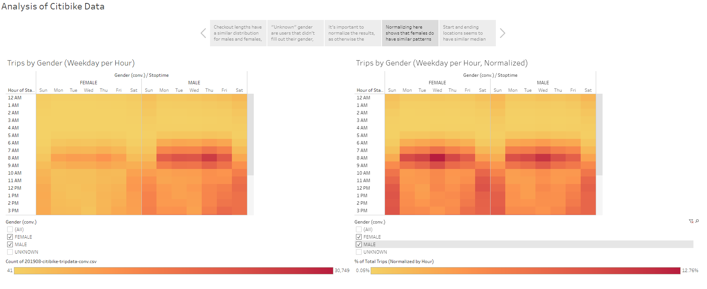
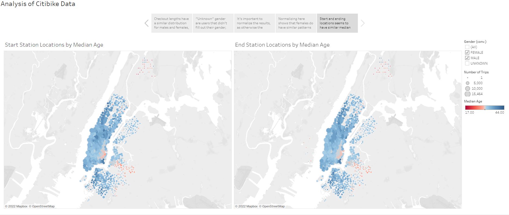
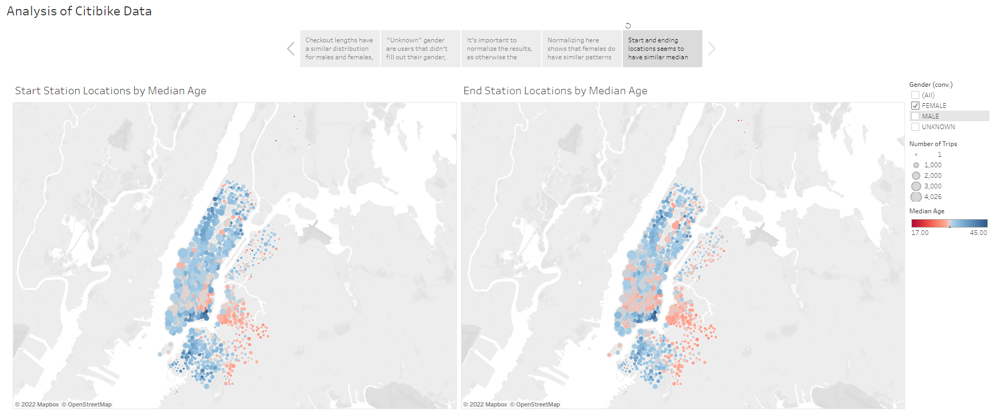

# Bikesharing Challenge
This project is an exercise for the Columbia University Data Science Bootcamp in using and displaying data with Tableau.

## Links
- Data was obtained from:
  - [https://s3.amazonaws.com/tripdata/201908-citibike-tripdata.csv.zip](https://s3.amazonaws.com/tripdata/201908-citibike-tripdata.csv.zip)
- Tableau Storyboard can be found at:
  - [https://public.tableau.com/app/profile/ross.eldridge/viz/ColumbiaDataBootcampChallenge14/AnalysisofCitibikeData](https://public.tableau.com/app/profile/ross.eldridge/viz/ColumbiaDataBootcampChallenge14/AnalysisofCitibikeData)

## Deliverable 1 - Datetime Conversion
The `tripduration` column was converted to a datetime as per the code in [NYC_CitiBike_Challenge.ipynb](NYC_CitiBike_Challenge.ipynb).
- Rather than replacing the column, a new column called `tripduration_conv` was created to hold the conversion.
- As well, I created a second conversion as `tripduration_conv_trim` to hold only the hour, minute, and second of the datetime, but this was not as useful for Tableau, so it remains unused.
- The DataFrame was exported to a modified **.csv** file without an index.

## Deliverable 2 - Visualizations
All visualizations will be present on story panels in one aspect or another.  If you would like to view a specific visualization, they can be found at the following sheets:
### Create the Checkout Times for Users Viz
[`Checkout Times for Users`](https://public.tableau.com/app/profile/ross.eldridge/viz/ColumbiaDataBootcampChallenge14/CheckoutTimesforUsers)
### Create the Checkout Times by Gender Viz
[`Checkout Times by Gender`](https://public.tableau.com/app/profile/ross.eldridge/viz/ColumbiaDataBootcampChallenge14/CheckoutTimesbyGender)
### Create the Trips by Weekday for Each Hour Viz
[`Trips by Weekday per Hour`](https://public.tableau.com/app/profile/ross.eldridge/viz/ColumbiaDataBootcampChallenge14/TripsbyWeekdayperHour)
### Create the Trips by Gender (Weekday per Hour) Viz
[`Trips by Gender (Weekday per Hour)`](https://public.tableau.com/app/profile/ross.eldridge/viz/ColumbiaDataBootcampChallenge14/TripsbyGenderWeekdayperHour)
### Create the User Trips by Gender by Weekday Viz
[`User Trips by Gender by Weekday`](https://public.tableau.com/app/profile/ross.eldridge/viz/ColumbiaDataBootcampChallenge14/UserTripsbyGenderbyWeekday)

## Deliverable 3 - Analysis
As a reminder, the Story Board can be accessed [here](https://public.tableau.com/app/profile/ross.eldridge/viz/ColumbiaDataBootcampChallenge14/AnalysisofCitibikeData).

### Overview
- A field called "Age" was created based on the user's birth year and the year of the data (2019).  This data is slightly dirty, but by not calculating for any null or 0 birth years, the number of outliers is small enough as to not affect the overall average too much, and the median can be used in other, more focused, places as well.

### Results
#### Checkout Durations
- If you look at how long users took on their bicycles, it's clear that males had far higher peaks - but this makes sense, given that there are around 3x as many male users as female users.
- However, looking at the "unknown" gendered users, their trips were far more spread out almost evenly, with the distribution not matching male or female numbers.  This is quite strange.
##### Screenshot

#### "Unknown" Genders - What We Know
- Looking at the "Unknown" gender compared to age, we can infer one important concept - "unknown" gender implies someone who did not fill out a gender when they signed up and took a trip.
  - We can infer this because of the huge, huge number of 50-year-old "unknown" gendered people - it's statistically impossible that over 207,000 "unknown" people happen to be 50 years old, and much more likely that "50" is the default age assigned to someone who doesn't fill out that part of the information as well.
  - We can guess that most of these people also didn't fill out other identifying information during the sign up process, and should exclude "Unknown" genders from future analyses so as not to skew the data.
- If you remove the "Unknown" gender's ages, you can see that a male average of 37.3 years and a female average of 35.9 years are fairly close and sensible.
##### Screenshot

#### Weekday Trips - Normalized
##### Screenshot

#### Hourly Trips - Normalized
##### Screenshot

#### Location Map
##### Screenshots

###### Male

###### Female

### Summary
