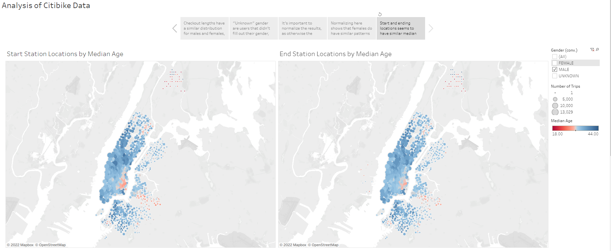

# Bikesharing Challenge
This project is an exercise for the Columbia University Data Science Bootcamp in using and displaying data with Tableau.

We will be analyzing some bicycle sharing data for New York City to justify and begin to plan a bicycle sharing service for Des Moines, Iowa.  We will look at some variables such as gender and age, and come up with a series of considerations to be made as we plan our Des Moines bicycle sharing service.

## Links
- Data was obtained from:
  - [https://s3.amazonaws.com/tripdata/201908-citibike-tripdata.csv.zip](https://s3.amazonaws.com/tripdata/201908-citibike-tripdata.csv.zip)
- Tableau Storyboard can be found at:
  - [https://public.tableau.com/app/profile/ross.eldridge/viz/ColumbiaDataBootcampChallenge14/AnalysisofCitibikeData](https://public.tableau.com/app/profile/ross.eldridge/viz/ColumbiaDataBootcampChallenge14/AnalysisofCitibikeData)

## Deliverable 1 - Datetime Conversion
The `tripduration` column was converted to a datetime as per the code in [NYC_CitiBike_Challenge.ipynb](NYC_CitiBike_Challenge.ipynb).
- Rather than replacing the column, a new column called `tripduration_conv` was created to hold the conversion.
- As well, I created a second conversion as `tripduration_conv_trim` to hold only the hour, minute, and second of the datetime, but this was not as useful for Tableau, so it remains unused.
- The DataFrame was exported to a modified *.csv* file without an index.

## Deliverable 2 - Visualizations
All visualizations will be present on story panels in one aspect or another.  If you would like to view a specific visualization, they can be found at the following sheets:
### Create the Checkout Times for Users Viz
[`Checkout Times for Users`](https://public.tableau.com/app/profile/ross.eldridge/viz/ColumbiaDataBootcampChallenge14/CheckoutTimesforUsers)
### Create the Checkout Times by Gender Viz
[`Checkout Times by Gender`](https://public.tableau.com/app/profile/ross.eldridge/viz/ColumbiaDataBootcampChallenge14/CheckoutTimesbyGender)
### Create the Trips by Weekday for Each Hour Viz
[`Trips by Weekday per Hour`](https://public.tableau.com/app/profile/ross.eldridge/viz/ColumbiaDataBootcampChallenge14/TripsbyWeekdayperHour)
### Create the Trips by Gender (Weekday per Hour) Viz
[`Trips by Gender (Weekday per Hour)`](https://public.tableau.com/app/profile/ross.eldridge/viz/ColumbiaDataBootcampChallenge14/TripsbyGenderWeekdayperHour)
### Create the User Trips by Gender by Weekday Viz
[`User Trips by Gender by Weekday`](https://public.tableau.com/app/profile/ross.eldridge/viz/ColumbiaDataBootcampChallenge14/UserTripsbyGenderbyWeekday)

## Deliverable 3 - Analysis
As a reminder, the Story Board can be accessed [here](https://public.tableau.com/app/profile/ross.eldridge/viz/ColumbiaDataBootcampChallenge14/AnalysisofCitibikeData).
I will put the number of visualizations present on each page in *(parentheses)*.

### Overview
This data, overall, shows typical trends in bike usage and parallels we can make between Des Moines and New York that can help support Bike Sharing in Des Moines.
- A feature called `Age` was generated based on the user's birth year and the year of the data (2019).  This data is slightly dirty, but by not calculating for any rows with `null` or `birth years = 0`, the number of outliers is small enough as to not affect the overall average too much, and the median can be used in other, more focused, places as well.

### Results
#### Checkout Durations (2 Visualizations)
- If you look at how long users took on their bicycles, it's clear that males had far higher peaks - but this makes sense, given that there are around 3x as many male users as female users.
- However, looking at the "Unknown" gendered users, their trips were far more spread out almost evenly, with the distribution not matching male or female numbers.  This is quite strange.

#### "Unknown" Genders - What We Know (2 Visualizations)
- Looking at the "Unknown" gender compared to age, we can infer one important concept - "Unknown" gender implies someone who did not fill out a gender when they signed up and took a trip.
  - We can infer this because of the huge, huge number of 50-year-old "unknown" gendered people - it's statistically impossible that over 207,000 "unknown" people happen to be exactly 50 years old, and much more likely that "50" is the default age (or rather, 1969 is the default birth year) assigned to someone who doesn't fill out that part of the information.
  - We can guess that most of these people also didn't fill out other identifying information during the sign up process, and should exclude "Unknown" genders from any gender analyses so as not to skew the data in other ways as well.
- If you remove the "Unknown" gender's ages, you can see that a male average of 37.3 years and a female average of 35.9 years are fairly close and sensible.

#### Weekday Trips - Normalized (3 Visualizations)
- Normalizing the data is incredibly important when comparing gender, as the 3:1 ratio of males to females (as seen in the table at the bottom) would skew the data significantly.  If you look at the two graphs in this section, the first emphasizes the male subscriber data while ignoring the rest.
- Instead, we can show the data by percent and tabulate it by pane, so that each pane has useful relative information (as compared to the absolute data).
  - We find that subscribers don't have a particular day that really stands out (likely because they may use the service daily) - if anything, they have the least traffic on Sundays.
  - Meanwhile, individual customers have much higher usage on and around the weekend compared to the middle of the work week, likely using the service on an impromptu basis.

#### Hourly Trips - Normalized (2 Visualizations)
- The heatmap of data here also needs to be normalized.  The "female" data is much less pronounced in the first graph, until it is taken as a percent and normalized in the second graph.
- Looking at trends, weekdays are most popular from 7:00-9:00AM as well as 5:00-7:00PM, correlating with a typical workday, showing that many of our users take bikes to and from work (and from the previous page, would make up many of our subscribers).
  - An interesting anomaly is Wednesday afternoons, when people take far few bicycles home than on other days (making Wednesday at 8:00AM seem like a peak).  Perhaps Wednesday nights are special in New York's social life, and we should be mindful of Des Moines' social life while taking variables into account.
- Meanwhile, weekends trips are more spread out throughout the day as a larger variety of users take bikes.

#### Location Maps (2 Visualizations)
- Here we can see a map containing start and end locations for our bike trips, colored by median age.  I have screenshotted three views of these maps - total, male only, and female only.
  - By color, we can clearly see that our male population is older than our female population.  The median for a given spot is consistently above the average for males, implying a right-skew on the data; meanwhile, the female data seems to have a left-skew.  This may be due to females feeling safer on a bike and using it at a lower age, or perhaps due to gender prefences on biking vs. walking, or other possible causations related to the social dynamics of the city.
  - The age correlations between locations seem to be consistent - in certain locations, there are stops where the median is far lower than average - perhaps due to the presence of a college or university.

##### Male and Female

###### Male

###### Female

### Summary
It will be important to study the social dynamics of the city of Des Moines to help determine how to best run a bike sharing company there.  Understanding which days the populace goes out after work, which sections of the city have an older or younger population, and many other aspects will be important when determining what bikes to use, how often they made need repairs, etc.  Des Moines may also have a different population makeup, and we may need to cater to a population with higher average ages, a difference in the number of male vs. female bike riders, etc.
#### Additional Visualization Ideas
- One additional graph of use may come from a combination of gender and trip duration.  We know that some variables - like *starting hour* and *weekday* - do not vary by gender, but there may be others that do.  Knowing whether males or females have longer commutes or take longer rides may play a role in how we distribute bicycles.
- Plotting `Start Station Id` and `End Station Id`, we could see if there are any stops where there are far more starts and stops, or vice versa.  This would imply that many bicycles would need to be redistributed from one location to another, which is an extra cost to the company that we can mitigate with pre-arranged contracts.
- We can also use those two variables try and come up with another feature that would be very useful to graph.  If we combined the `Start Station Id` and `End Station Id` fields together into a single entity, we could see the distribution of trip itineraries in a graph.  We could identify if there are any routes that are particularly common (hopefully in both directions) - maybe even making an "express" section with bikes that can only be picked up and dropped off between two commonly ridden locations.
